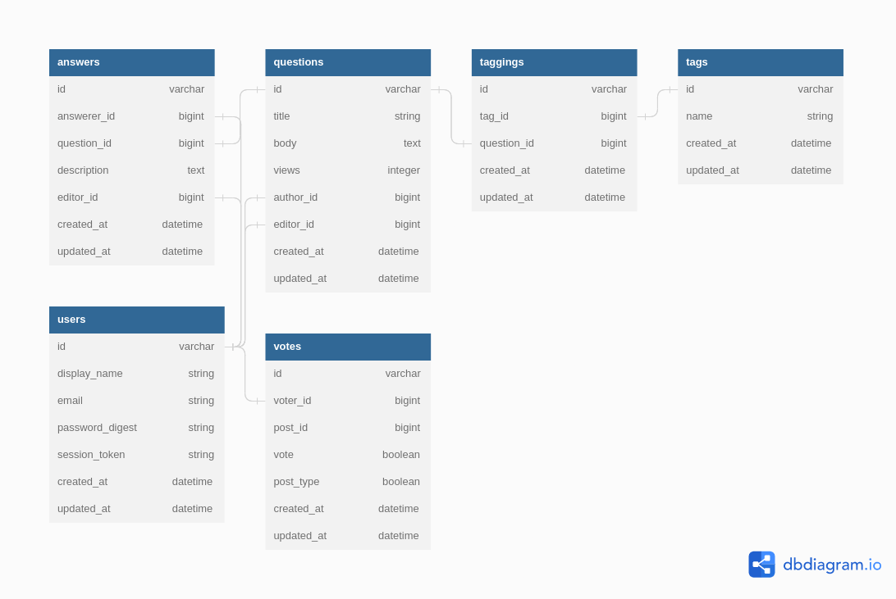

# Codeoverflow
- Codeoverflow is a clone of StackOverflow, built with Ruby on Rails and PostgreSQL. It allows members of the Moringa School organization to ask questions and receive answers from their peers.

# Installation
- To install and run this app on your local machine, follow these steps:

# Clone the repository:
Copy code
```console
$ git clone https://github.com/RemmyKyalo/CodeOverflow.git
```

# Install the required dependencies by running:
Copy code
```console
$ bundle install
```
# Create the database and run migrations:

Copy code
```console
$ rails db:create
```
```console
$ rails db:migrate
```
# Run the app:
Copy code
```console
$ rails server
```
- The server is  now running on console http://localhost:5000.
# Schema
 <a href="https://dbdiagram.io/d/643e392a6b31947051c4d1e6" style="color: green">ERD  Link</a>

 
 


- The database schema is defined in db/schema.rb. Here is an overview of the schema:

- users: contains information about registered users such as display name, email, and password digest.
- questions: contains information about questions posted by users such as title, body, and number of views.
- answers: contains information about answers posted by users such as description and the corresponding question.
- tags: contains information about tags that can be assigned to questions.
- taggings: links tags to questions.
- votes: allows users to vote on posts (questions and answers).
# Tech Stack
- Ruby on Rails for backend
- React for frontend
- Redux
- PostgreSQL
- ThunderClient
- Sessions
- Heroku
# Contributing
- If you want to contribute to Codeoverflow, please follow these steps:

# Fork the repository.
- Create a new branch for your feature or bug fix: git checkout -b my-new-feature.
- Make changes and commit them: git commit -am 'Add some feature'.
- Push to the branch: git push origin my-new-feature.
- Submit a pull request.

# Developers Github's
- <a href="https://github.com/RemmyKyalo" style="color: green">Kyalo</a>
- <a href="https://github.com/JohnOkari" style="color: green">John</a>
- <a href="https://github.com/antonyosebe" style="color: green">Antony</a>
- <a href="https://github.com/Josphat-Kip" style="color: green">Josphat</a>
- <a href="https://github.com/kefahwambai" style="color: green">Keffa</a>
- <a href="https://github.com/Ombasabuya" style="color: green">Ombasa</a>


# License
- Codeoverflow is released under the MIT License.
